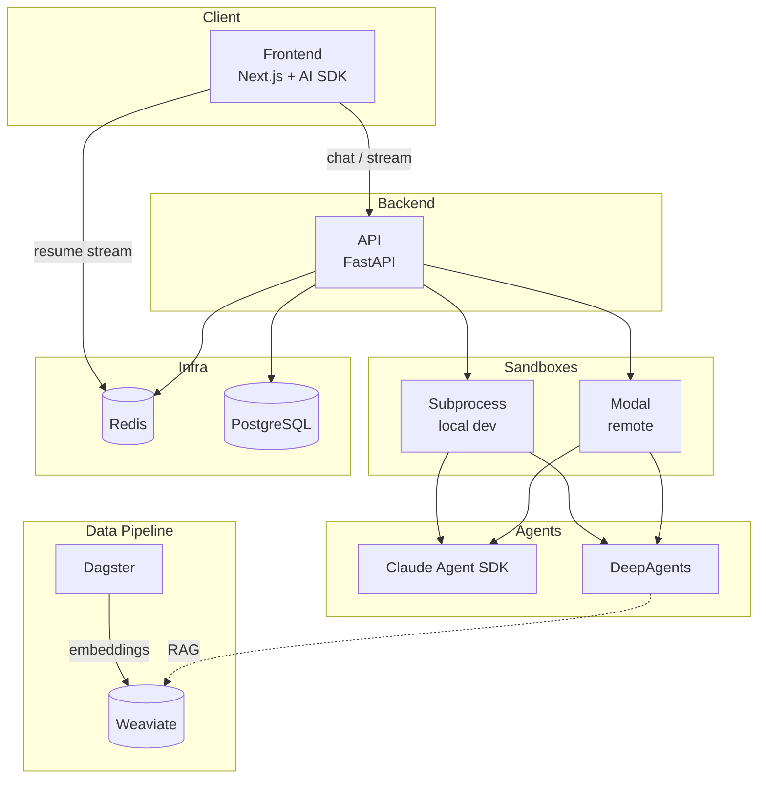

# Mobox

Mobox is a platform for running AI agents in isolated sandboxes, with data ingestion, orchestration, and a streaming chat interface.

## Table of Contents

- [Architecture](#architecture)
- [What's Included](#whats-included)
  - [Data Ingestion](#data-ingestion)
  - [Agents](#agents)
  - [API](#api)
  - [Sandbox Execution](#sandbox-execution)
  - [Frontend](#frontend)
  - [Stream Resumption](#stream-resumption)
- [Quick Start](#quick-start)

## Architecture



## What's Included

### Data Ingestion

- **PDF processing** using [Dagster](https://dagster.io/) and [Weaviate](https://weaviate.io/)
- Local embeddings via Weaviate's `text2vec-transformers` module (sentence-transformers)
- Pipeline: discover PDFs → extract text → chunk → save to Weaviate with auto-generated embeddings

### Agents

- **Claude Agent SDK** and **DeepAgents** (LangChain) frameworks
- Harnesses that encapsulate simple agents with orchestration, sub-agents, and tools
- Examples: hello-world, research (orchestrator + researcher), multi-hop RAG

### API

- FastAPI backend to orchestrate agent execution and session management
- Chat endpoints, session CRUD, and streaming support

### Sandbox Execution

- **Local**: subprocess sandbox (`uv run python run_agent.py`) for development
- **Remote**: [Modal](https://modal.com/) sandboxes for isolated container execution in production

### Frontend

- Next.js app using the [Vercel AI SDK](https://sdk.vercel.ai/)
- Parses multiple agent event formats (Claude, DeepAgents) into a unified AI SDK stream format
- Chat UI with reasoning blocks, tool calls, and progress indicators

### Stream Resumption

- Stream resume with Redis using AI SDK's resumable streams
- Survives page refresh and client disconnects when `REDIS_URL` is configured

## Quick Start

```bash
# Start services (Postgres, Redis, Weaviate, Dagster, API)
docker compose up -d

# Run frontend (from project root)
cd frontend && npm run dev

# Run API (from project root)
cd api && uv run fastapi dev
```

See `Makefile`, `docker-compose.yaml`, and `AGENTS.md` for more details.
